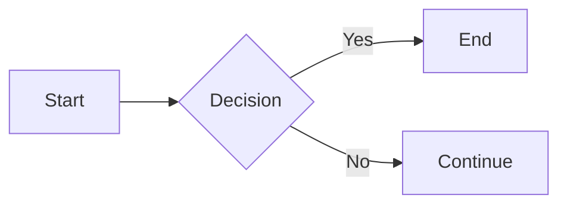

# Architecture Diagrams

This directory contains visual documentation for the AkujobiP1Shell project using Mermaid diagrams.

## Diagrams Available

### 1. Component Architecture (`architecture.md`)
Shows the high-level architecture and module interactions.

**What it covers:**
- All 5 main modules (shell, config, parser, builtins, executor)
- Data flow between components
- POSIX system calls used by each module
- Key design decisions

**View:** [architecture.md](./architecture.md)

### 2. Data Flow (`data_flow.md`)
Shows the complete flow from user input to command execution.

**What it covers:**
- Main REPL loop structure
- Command parsing process
- Built-in vs external dispatch logic
- Signal handling (Ctrl+C, Ctrl+D)
- Error handling paths
- Exit codes and display logic

**View:** [data_flow.md](./data_flow.md)

### 3. System Call Flow (`syscall_flow.md`)
Detailed sequence diagram of the fork/exec/wait pattern.

**What it covers:**
- Complete fork/exec/wait sequence
- Parent and child process timelines
- POSIX system call details with references
- Status extraction using WIFEXITED, WEXITSTATUS, etc.
- Signal handling in child processes
- Exit code conventions
- Race condition prevention

**View:** [syscall_flow.md](./syscall_flow.md)

### 4. Configuration Loading (`config_loading.md`)
Shows the priority-based configuration system.

**What it covers:**
- 4-level priority hierarchy
- Deep merge algorithm
- Path expansion (~ and $VAR)
- Validation process
- Error handling for invalid configs
- Complete configuration structure

**View:** [config_loading.md](./config_loading.md)

## How to View Diagrams

### Option 1: GitHub (Recommended)
GitHub automatically renders Mermaid diagrams. Simply view the files on GitHub:

1. Navigate to `docs/diagrams/` on GitHub
2. Click any `.md` file
3. Diagrams render automatically

### Option 2: VS Code
Install the Mermaid extension:

1. Install "Markdown Preview Mermaid Support" extension
2. Open any diagram `.md` file
3. Press `Ctrl+Shift+V` (or `Cmd+Shift+V` on Mac) for preview
4. Diagrams render in the preview pane

### Option 3: Online Mermaid Editor
Copy and paste the diagram code:

1. Go to https://mermaid.live/
2. Copy the code between ` ```mermaid` and ` ``` ` from any file
3. Paste into the editor
4. View and export as needed

### Option 4: Command Line (requires npm)
Install and use mermaid-cli:

```bash
npm install -g @mermaid-js/mermaid-cli

# Convert to PNG
mmdc -i architecture.md -o architecture.png

# Convert to SVG
mmdc -i architecture.md -o architecture.svg -t neutral
```

### Option 5: Markdown Viewers
Most modern markdown viewers support Mermaid:
- Typora
- Mark Text
- Obsidian
- Notion (copy/paste)

## Diagram Format

All diagrams are written in Mermaid syntax, which is:
- Text-based (version control friendly)
- Renders to graphics automatically
- Easy to edit and maintain
- Professional appearance

### Example Mermaid Syntax



## Editing Diagrams

To edit diagrams:

1. Open the `.md` file in any text editor
2. Locate the ` ```mermaid` code block
3. Edit the Mermaid syntax
4. Preview using one of the viewing options above
5. Save when satisfied

### Mermaid Documentation
- Official docs: https://mermaid.js.org/
- Live editor: https://mermaid.live/
- Syntax guide: https://mermaid.js.org/intro/

## Using Diagrams in Report

These diagrams are designed to be included in the main project report:

1. **In Markdown:** Reference directly or copy the Mermaid code blocks
2. **In PDF:** Convert to PNG/SVG first, then include images
3. **In Presentation:** Export as high-resolution images

## Color Scheme

Diagrams use consistent color coding:

- **Light Blue** (`#e1f5ff`): Main components (shell)
- **Orange** (`#fff3e0`): Configuration-related
- **Purple** (`#f3e5f5`): Parsing-related
- **Light Green** (`#e8f5e9`): Built-in commands
- **Light Red** (`#ffebee`): External execution
- **Gray** (`#fafafa`): External entities (user, files)

## File Structure

```
docs/diagrams/
├── README.md                 # This file
├── architecture.md           # Component architecture
├── data_flow.md             # Command execution flow
├── syscall_flow.md          # Fork/exec/wait sequence
└── config_loading.md        # Configuration system
```

## For Graders

These diagrams demonstrate:
- Deep understanding of system architecture
- Knowledge of POSIX system calls
- Ability to explain complex processes visually
- Professional documentation standards
- Attention to detail in documentation

Each diagram includes:
- Clear visual representation
- Detailed explanatory text
- POSIX standard references where applicable
- Code examples
- Real-world usage scenarios

---

**Created:** 2025-11-10  
**Author:** John Akujobi  
**Email:** john@jakujobi.com  
**Project:** AkujobiP1Shell - CSC456 Programming Assignment 1

