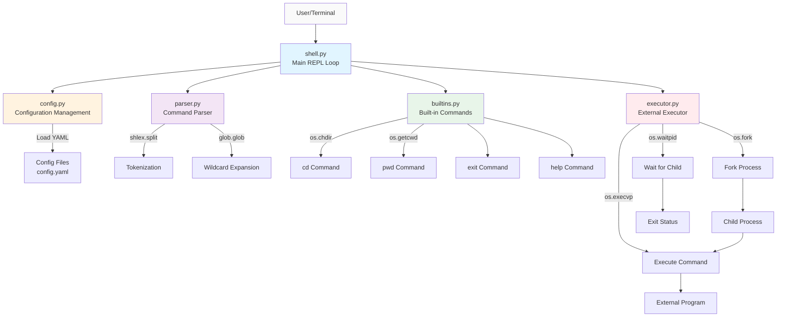

# Component Architecture Diagram

This diagram shows the high-level architecture of AkujobiP1Shell and how the modules interact.

## Component Descriptions

### shell.py - Main REPL Loop
- Entry point for the shell application
- Implements the Read-Eval-Print Loop (REPL)
- Coordinates all other modules
- Handles signal processing (Ctrl+C, Ctrl+D)
- Provides error recovery and defensive programming

### config.py - Configuration Management
- Loads configuration from YAML files
- Implements priority-based merging (4 levels)
- Expands paths and environment variables
- Validates configuration structure
- Provides defaults for missing values

### parser.py - Command Parser
- Tokenizes command line input using `shlex.split()`
- Handles quoted arguments (single and double quotes)
- Expands wildcards using `glob.glob()`
- Returns parsed argument list

### builtins.py - Built-in Commands
- Implements shell built-in commands
- Commands execute without forking
- Uses POSIX system calls (chdir, getcwd)
- Provides: exit, cd, pwd, help

### executor.py - External Executor
- Executes external commands via fork/exec/wait
- Implements POSIX process management
- Handles signal routing to child processes
- Displays exit codes based on configuration
- Supports POSIX exit status extraction

## Data Flow

1. **User Input**: User types command at prompt
2. **Configuration**: Shell loads config (if not already loaded)
3. **Parsing**: Command line is parsed into arguments
4. **Dispatch Decision**: Check if built-in or external
5. **Execution**: Execute via built-in or fork/exec/wait
6. **Output**: Display results and exit codes
7. **Loop**: Return to prompt for next command

## Key Design Decisions

1. **Module Separation**: Each component has a single, clear responsibility
2. **POSIX Compliance**: Uses standard POSIX system calls throughout
3. **Configuration Priority**: Higher-priority configs override lower ones
4. **Error Resilience**: Defensive programming prevents shell crashes
5. **No Custom Signal Handlers**: Relies on Python's default signal behavior

---

**Created:** 2025-11-10  
**Author:** John Akujobi  
**Project:** AkujobiP1Shell - CSC456 Programming Assignment 1

