# Configuration Loading Diagram

This diagram shows the priority-based configuration loading and merging process.

```mermaid
flowchart TD
    Start([Shell Starts]) --> GetDefaults[Load Built-in Defaults<br/>get_default_config]
    
    GetDefaults --> CreateBase[Create Base Config]
    CreateBase --> |prompt.text: AkujobiP1><br/>exit.message: Bye!<br/>show_exit_codes: on_failure<br/>etc.| Base[Base Configuration]
    
    Base --> CheckUser{User Config<br/>Exists?}
    
    CheckUser -->|No| CheckLocal
    CheckUser -->|Yes| LoadUser[Load User Config<br/>~/.config/akujobip1/config.yaml]
    
    LoadUser --> ParseUser{Parse<br/>Success?}
    ParseUser -->|No| WarnUser[Print Warning<br/>Invalid YAML]
    ParseUser -->|Yes| MergeUser[Deep Merge<br/>User -> Base]
    
    WarnUser --> CheckLocal
    MergeUser --> Config1[Configuration<br/>Priority 1]
    Config1 --> CheckLocal
    
    CheckLocal{Local Config<br/>Exists?}
    CheckLocal -->|No| CheckEnv
    CheckLocal -->|Yes| LoadLocal[Load Local Config<br/>./akujobip1.yaml]
    
    LoadLocal --> ParseLocal{Parse<br/>Success?}
    ParseLocal -->|No| WarnLocal[Print Warning<br/>Invalid YAML]
    ParseLocal -->|Yes| MergeLocal[Deep Merge<br/>Local -> Config]
    
    WarnLocal --> CheckEnv
    MergeLocal --> Config2[Configuration<br/>Priority 2]
    Config2 --> CheckEnv
    
    CheckEnv{$AKUJOBIP1_CONFIG<br/>Set?}
    CheckEnv -->|No| ExpandPaths
    CheckEnv -->|Yes| LoadEnv[Load Environment Config<br/>$AKUJOBIP1_CONFIG path]
    
    LoadEnv --> ParseEnv{Parse<br/>Success?}
    ParseEnv -->|No| WarnEnv[Print Warning<br/>Invalid config file]
    ParseEnv -->|Yes| MergeEnv[Deep Merge<br/>Env -> Config]
    
    WarnEnv --> ExpandPaths
    MergeEnv --> Config3[Configuration<br/>Priority 3]
    Config3 --> ExpandPaths
    
    ExpandPaths[Expand Paths<br/>~ and $VAR]
    ExpandPaths --> |~/.akujobip1.log<br/>-> /home/user/.akujobip1.log| ConfigExpanded[Expanded Configuration]
    
    ConfigExpanded --> Validate[Validate Config<br/>Check types, enums]
    
    Validate --> CheckValid{All<br/>Valid?}
    CheckValid -->|No| WarnValidation[Print Warnings<br/>Use defaults for invalid]
    CheckValid -->|Yes| FinalConfig
    WarnValidation --> FinalConfig[Final Configuration<br/>Ready for Use]
    
    FinalConfig --> End([Return to Shell])
    
    style Start fill:#e8f5e9
    style End fill:#e8f5e9
    style Base fill:#fff3e0
    style Config1 fill:#fff3e0
    style Config2 fill:#fff3e0
    style Config3 fill:#fff3e0
    style ConfigExpanded fill:#fff3e0
    style FinalConfig fill:#c8e6c9
    
    style WarnUser fill:#ffcdd2
    style WarnLocal fill:#ffcdd2
    style WarnEnv fill:#ffcdd2
    style WarnValidation fill:#ffcdd2
```



## Configuration Priority Order

Configuration is loaded in priority order (later overrides earlier):

1. **Built-in Defaults** (Lowest Priority)
   - Hardcoded in `config.py`
   - Always available
   - Ensures shell always works

2. **User Config** (Priority 1)
   - Location: `~/.config/akujobip1/config.yaml`
   - User-wide settings
   - Applies to all shell instances for user

3. **Local Config** (Priority 2)
   - Location: `./akujobip1.yaml` (current directory)
   - Project-specific settings
   - Overrides user config

4. **Environment Variable** (Highest Priority)
   - Location: `$AKUJOBIP1_CONFIG` environment variable
   - Points to custom config file
   - Overrides all other configs

## Deep Merge Algorithm

The configuration uses deep merging, not replacement:

### Example

**Base Config:**
```yaml
prompt:
  text: "shell> "
execution:
  show_exit_codes: "on_failure"
  exit_code_format: "[Exit: {code}]"
```

**Override Config:**
```yaml
prompt:
  text: "custom> "
execution:
  show_exit_codes: "always"
```

**Merged Result:**
```yaml
prompt:
  text: "custom> "              # Overridden
execution:
  show_exit_codes: "always"     # Overridden
  exit_code_format: "[Exit: {code}]"  # Preserved from base
```

### Merge Rules

1. **Nested Dictionaries:** Recursively merged
2. **Primitive Values:** Override completely replaces base
3. **Lists:** Override replaces base (not concatenated)
4. **Missing Keys:** Preserve from base

**Implementation:**
```python
def merge_config(base: dict, override: dict) -> dict:
    result = copy.deepcopy(base)
    for key, value in override.items():
        if key in result and isinstance(result[key], dict) and isinstance(value, dict):
            result[key] = merge_config(result[key], value)
        else:
            result[key] = copy.deepcopy(value)
    return result
```

## Path Expansion

After merging, all path strings are expanded:

### Tilde Expansion (~)
- `~/.akujobip1.log` → `/home/user/.akujobip1.log`
- Uses `os.path.expanduser()`

### Environment Variable Expansion
- `$HOME/logs/shell.log` → `/home/user/logs/shell.log`
- Uses `os.path.expandvars()`

### Recursive Expansion
Walks entire config dictionary and expands any string containing `~` or `$`.

## Validation

After loading and merging, configuration is validated:

### Type Checks
- **Booleans:** `glob.enabled`, `errors.verbose`, etc.
- **Strings:** `prompt.text`, `exit.message`, etc.
- **Enums:** `show_exit_codes` must be "never", "on_failure", or "always"

### Behavior on Invalid Values
- **Print Warning:** Notify user of invalid value
- **Use Default:** Fall back to built-in default
- **Continue:** Shell doesn't crash on config errors

### Example Validation
```python
if show_mode not in ["never", "on_failure", "always"]:
    print(f"Warning: Invalid show_exit_codes '{show_mode}'")
    # Shell uses default value "on_failure"
```

## Configuration File Locations

### User Config Directory
```
~/.config/akujobip1/
└── config.yaml
```

Created manually by user. Not created automatically by shell.

### Local Config
```
./akujobip1.yaml
```

In current working directory. Useful for project-specific settings.

### Environment Variable
```bash
export AKUJOBIP1_CONFIG="/path/to/custom/config.yaml"
akujobip1
```

Highest priority, overrides everything.

## Complete Configuration Structure

```yaml
# Prompt configuration
prompt:
  text: "AkujobiP1> "

# Exit command configuration
exit:
  message: "Bye!"

# External command execution
execution:
  show_exit_codes: "on_failure"  # never, on_failure, always
  exit_code_format: "[Exit: {code}]"

# Wildcard expansion
glob:
  enabled: true
  show_expansions: false

# Built-in commands
builtins:
  cd:
    enabled: true
    show_pwd_after: false
  pwd:
    enabled: true
  help:
    enabled: true

# Error handling
errors:
  verbose: false  # Show full tracebacks

# Debug settings
debug:
  log_commands: false
  log_file: "~/.akujobip1.log"
  show_fork_pids: false
```

## Usage Examples

### Minimal User Config
```yaml
# ~/.config/akujobip1/config.yaml
prompt:
  text: "$ "
exit:
  message: "Goodbye!"
```

### Verbose Local Config
```yaml
# ./akujobip1.yaml (in project directory)
execution:
  show_exit_codes: "always"
errors:
  verbose: true
debug:
  show_fork_pids: true
```

### Custom Config via Environment
```bash
# Create custom config
cat > /tmp/myconfig.yaml << EOF
prompt:
  text: "[shell]> "
execution:
  show_exit_codes: "never"
EOF

# Use it
export AKUJOBIP1_CONFIG="/tmp/myconfig.yaml"
akujobip1
```

## Error Handling

### Missing Files
- Silently skipped
- No error printed
- Shell continues with available configs

### Invalid YAML
- Warning printed to stderr
- File is skipped
- Shell continues

### Invalid Values
- Warning printed to stderr
- Default value used
- Shell continues

### Philosophy
**Defensive Configuration:**
- Never crash on config errors
- Always have working defaults
- Inform user but continue
- Graceful degradation

---

**Created:** 2025-11-10  
**Author:** John Akujobi  
**Project:** AkujobiP1Shell - CSC456 Programming Assignment 1

