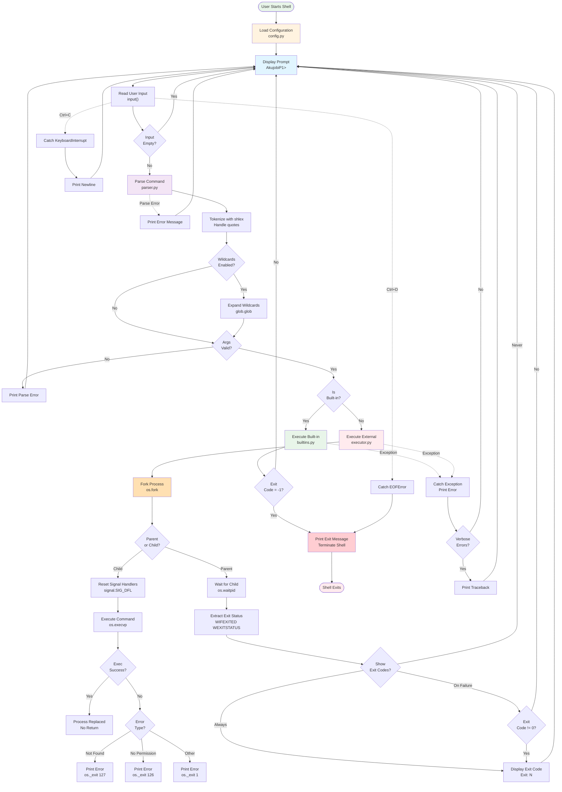

# Data Flow Diagram

This diagram shows the flow of data and control through the shell from user input to command execution.

## Flow Description

### 1. Initialization Phase
1. Shell starts and loads configuration from YAML files
2. Configuration is merged with priority order
3. Default values are applied for missing settings

### 2. Main Loop (REPL)
1. **Display Prompt**: Shows configured prompt text
2. **Read Input**: Waits for user input using `input()`
3. **Empty Check**: Skips empty lines and whitespace

### 3. Parsing Phase
1. **Tokenization**: Uses `shlex.split()` to handle quotes
2. **Wildcard Expansion**: Expands `*`, `?`, `[...]` if enabled
3. **Validation**: Returns empty list on parse errors

### 4. Dispatch Phase
1. **Built-in Check**: Looks up command in built-in registry
2. **Route**: Sends to built-in handler or external executor

### 5a. Built-in Execution
1. **Direct Execution**: No forking, runs in same process
2. **Exit Detection**: Checks for return code -1 (exit command)
3. **Continue**: Returns to prompt for next command

### 5b. External Execution
1. **Fork**: Creates child process duplicate
2. **Child Path**: 
   - Resets signal handlers
   - Executes command with `execvp()`
   - Exits with error code if exec fails
3. **Parent Path**:
   - Waits for child with `waitpid()`
   - Extracts exit status with POSIX macros
   - Displays exit code based on configuration

### 6. Signal Handling
- **Ctrl+D (EOF)**: Exits shell gracefully with exit message
- **Ctrl+C (SIGINT)**: Cancels current line, shows new prompt
- **Child Signals**: Routed to child process, not parent shell

### 7. Error Handling
- **Parse Errors**: Prints error, shows new prompt
- **Execution Errors**: Catches exceptions, continues running
- **Verbose Mode**: Optionally shows full tracebacks

## Key Decision Points

### Is Built-in?
- **Yes**: Execute directly without forking (cd, pwd, help, exit)
- **No**: Use fork/exec/wait pattern for external commands

### Exit Code = -1?
- **Yes**: Exit command was executed, terminate shell
- **No**: Continue to next iteration of REPL loop

### Show Exit Codes?
- **Never**: Don't display any exit codes
- **On Failure**: Display only when exit code is non-zero
- **Always**: Display exit code for every command

## Exit Codes

Standard POSIX exit codes:
- **0**: Success
- **1-125**: Command-specific errors
- **126**: Permission denied (cannot execute)
- **127**: Command not found
- **128+N**: Terminated by signal N

---

**Created:** 2025-11-10  
**Author:** John Akujobi  
**Project:** AkujobiP1Shell - CSC456 Programming Assignment 1

