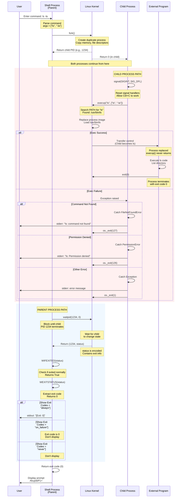

# System Call Flow Diagram

This diagram shows the detailed sequence of POSIX system calls during external command execution.



## Detailed System Call Explanation

### 1. fork() - Process Creation

**POSIX Reference:** https://pubs.opengroup.org/onlinepubs/9699919799/functions/fork.html

**Purpose:** Creates an exact duplicate of the calling process.

**What Gets Duplicated:**
- Process memory (copy-on-write)
- Open file descriptors
- Current working directory
- Environment variables
- Signal handlers

**Return Values:**
- **In Parent:** Returns child's PID (positive integer)
- **In Child:** Returns 0
- **On Error:** Returns -1 (Python raises OSError)

**Python Implementation:**
```python
pid = os.fork()
if pid == 0:
    # Child process path
    pass
else:
    # Parent process path (pid = child's PID)
    pass
```

### 2. execvp() - Process Replacement

**POSIX Reference:** https://pubs.opengroup.org/onlinepubs/9699919799/functions/exec.html

**Purpose:** Replaces the current process image with a new program.

**Why execvp() specifically:**
- **v**: Arguments passed as vector (array)
- **p**: Searches PATH environment variable for executable

**What Happens:**
1. Kernel searches PATH for the command
2. Loads executable into memory
3. Replaces process image (code, data, heap, stack)
4. Preserves: PID, open files, working directory
5. Resets: Signal handlers to default

**Never Returns on Success:**
- If exec succeeds, the process is completely replaced
- The old process code no longer exists
- Only returns (via exception) if exec fails

**Python Implementation:**
```python
try:
    os.execvp(args[0], args)
    # Never reaches here if successful
except FileNotFoundError:
    os._exit(127)  # Command not found
except PermissionError:
    os._exit(126)  # Cannot execute
```

**Why os._exit() not sys.exit():**
- `os._exit()`: Immediate termination, no Python cleanup
- `sys.exit()`: Raises SystemExit, runs cleanup handlers
- In forked child, we must use `os._exit()` to avoid:
  - Flushing parent's file buffers twice
  - Running parent's atexit handlers
  - Interfering with parent's state

### 3. waitpid() - Wait for Child

**POSIX Reference:** https://pubs.opengroup.org/onlinepubs/9699919799/functions/wait.html

**Purpose:** Suspends execution until specified child changes state.

**Why waitpid() vs wait():**
- `waitpid(pid, options)`: Wait for specific child
- `wait()`: Wait for any child
- waitpid() gives better control

**Options Parameter:**
- **0**: Wait for termination only
- **WNOHANG**: Return immediately if child hasn't exited
- **WUNTRACED**: Also return for stopped children

**Return Value:**
- **Tuple:** (child_pid, status)
- **status:** Encoded integer containing exit information

**Python Implementation:**
```python
child_pid, status = os.waitpid(pid, 0)
```

### 4. Status Extraction Macros

**POSIX Reference:** https://pubs.opengroup.org/onlinepubs/9699919799/functions/wait.html

The status value is encoded and requires POSIX macros to interpret:

#### WIFEXITED(status)
- **Returns:** True if process exited normally (via exit() or return)
- **Use:** Check before extracting exit code

#### WEXITSTATUS(status)
- **Returns:** Exit code (0-255)
- **Use:** Only if WIFEXITED is True

#### WIFSIGNALED(status)
- **Returns:** True if process was terminated by signal
- **Use:** Check for abnormal termination

#### WTERMSIG(status)
- **Returns:** Signal number that terminated process
- **Use:** Only if WIFSIGNALED is True

**Python Implementation:**
```python
if os.WIFEXITED(status):
    exit_code = os.WEXITSTATUS(status)
    return exit_code
elif os.WIFSIGNALED(status):
    signal_num = os.WTERMSIG(status)
    return 128 + signal_num
```

## Signal Handling

### Why Reset Signal Handlers in Child?

```python
signal.signal(signal.SIGINT, signal.SIG_DFL)
```

**Problem:** If child inherits parent's signal handlers, Ctrl+C would kill the shell.

**Solution:** Reset to default handlers immediately after fork.

**Timing is Critical:**
- Must be first thing done in child
- Prevents race condition where signal arrives before reset

### Signal Flow

1. **User presses Ctrl+C**
2. **Kernel sends SIGINT to foreground process group**
3. **Child receives signal**: Default handler terminates process
4. **Parent receives signal**: Python's handler raises KeyboardInterrupt (caught in REPL)

## Race Conditions

### Fork/Exec Race Window

**Problem:** Brief window between fork() and execvp() where:
- Child has parent's memory image
- Signal handlers not yet reset
- Could cause issues

**Solution:** Reset signals immediately after fork check.

### Zombie Processes

**Problem:** If parent doesn't call waitpid(), child becomes zombie.

**Solution:** Always call waitpid() after forking.

**Zombies in Shell:**
- Shell always waits for foreground processes
- No background jobs, so no zombie risk

## Exit Code Conventions

### Standard POSIX Codes

- **0**: Success
- **1**: General error
- **2**: Misuse of shell command
- **126**: Permission denied (cannot execute)
- **127**: Command not found
- **128+N**: Terminated by signal N
  - 130: SIGINT (Ctrl+C) - 128 + 2
  - 137: SIGKILL - 128 + 9
  - 139: SIGSEGV (segfault) - 128 + 11
  - 143: SIGTERM - 128 + 15

### Command-Specific Codes (1-125)

Programs can return any value 1-125 for their own error conditions:
- grep: 1 = no matches found
- diff: 1 = files differ
- test: 1 = expression is false

---

**Created:** 2025-11-10  
**Author:** John Akujobi  
**Project:** AkujobiP1Shell - CSC456 Programming Assignment 1

