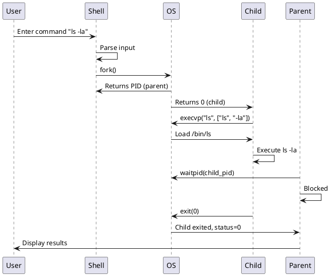

# AkujobiP1Shell - Comprehensive Requirements Analysis

**Project:** CSC456 Programming Assignment 1 - Simple Shell Implementation
**Author:** John Akujobi
**Date:** 2025-11-09
**Target OS:** Linux (Primary), Windows (Secondary)
**Language:** Python 3.10+

---

## Table of Contents

1. [Implementation Language &amp; Environment](#1-implementation-language--environment)
2. [Core Functionality Scope](#2-core-functionality-scope)
3. [Error Handling &amp; Edge Cases](#3-error-handling--edge-cases)
4. [Process Management Details](#4-process-management-details)
5. [Testing &amp; Validation Strategy](#5-testing--validation-strategy)
6. [Documentation Requirements](#6-documentation-requirements)
7. [Configuration System](#7-configuration-system)
8. [Submission &amp; Deliverables](#8-submission--deliverables)
9. [Final Requirements Summary](#9-final-requirements-summary)

---

## 1. Implementation Language & Environment

### 1.1 Language Options

#### Option A: Python 3.10+

**Pros:**

- Rapid development and easier debugging
- Built-in `os` module provides fork(), execvp(), wait() wrappers
- Better cross-platform compatibility (Linux/Windows/macOS)
- Exception handling is cleaner and more intuitive
- String parsing is simpler (shlex module for quoted arguments)
- Already configured in pyproject.toml
- Educational value: demonstrates concepts without C pointer complexity

**Cons:**

- Not "true" system calls (uses C bindings underneath)
- Slightly higher overhead than compiled C
- Less traditional for systems programming courses
- May not demonstrate raw POSIX API usage as clearly

**Cross-Platform Notes:**

- `os.fork()` not available on Windows (need alternative approach)
- Can use `subprocess` module as fallback for Windows
- Primary focus is Linux, Windows is secondary

---

#### Option B: C/C++

**Pros:**

- Direct system call usage (fork, execvp, wait are native)
- Traditional approach for systems programming
- Better demonstrates low-level process management
- Smaller binary size and faster execution
- More "authentic" POSIX programming experience

**Cons:**

- More complex development (manual memory management)
- Pointer arithmetic and buffer management required
- More difficult to parse arguments (manual tokenization)
- Compilation required (platform-specific)
- Longer development time
- Requires rewriting entire project structure

---

**DECISION: Python 3.10+**

**Rationale:**

- Project already configured for Python
- Meets all assignment requirements (process management using system calls)
- Python's `os.fork()`, `os.execvp()`, `os.wait()` are thin wrappers around POSIX calls
- Faster development allows more time for testing and documentation
- Better code readability for academic submission
- Cross-platform support bonus (Linux primary, Windows possible with subprocess fallback)

---

### 1.2 Platform Support

#### Primary Target: Linux (Ubuntu)

- Use POSIX system calls: `os.fork()`, `os.execvp()`, `os.wait()`
- Test on Ubuntu (latest LTS recommended: 22.04 or 24.04)
- Full feature support expected

#### Secondary Target: Windows (Optional)

- Challenge: `os.fork()` not available on Windows
- Solution: Implement fallback using `subprocess.Popen()`
- Detect platform and use appropriate implementation
- Windows features: limited (no true fork, but can execute commands)

**Implementation Strategy:**

```python
import os
import sys
import subprocess

def execute_command(args):
    if sys.platform == "win32":
        # Windows fallback using subprocess
        subprocess.call(args)
    else:
        # Linux/Unix using fork/exec
        pid = os.fork()
        if pid == 0:
            os.execvp(args[0], args)
        else:
            os.wait()
```

---

## 2. Core Functionality Scope

### 2.1 Command Types

#### Option A: External Commands Only

**Description:** Execute only external programs (ls, cp, mkdir, grep, etc.)

**Pros:**

- Simpler implementation (pure fork/exec pattern)
- Meets core assignment requirements
- No special case handling needed
- Clearer demonstration of process management

**Cons:**

- Cannot change shell state (no `cd` to change directory)
- Less feature-complete as a shell
- Users might expect built-in commands

**Examples:**

- `ls -la` ✓
- `cp file1.txt file2.txt` ✓
- `mkdir newdir` ✓
- `cd /home` ✗ (would fork/exec /bin/cd, which exits immediately)

---

#### Option B: Built-in Commands + External Commands

**Description:** Implement shell built-ins (cd, exit, pwd) + external commands

**Pros:**

- More realistic shell behavior
- Allows state changes (cd changes working directory)
- Better user experience
- Demonstrates understanding of why built-ins exist

**Cons:**

- More complex implementation (need command dispatch)
- Requires special handling for built-ins (no fork)
- More code to test and document

**Implementation Required:**

- Command dispatcher to check if command is built-in
- Built-in handlers: `cd`, `exit`, `pwd`, `export`, etc.
- External command handler using fork/exec

**Examples:**

- `cd /home` - handled by shell (changes shell's cwd)
- `exit` - handled by shell (terminates shell)
- `ls -la` - forked/exec'd external command

---

**DECISION: Built-in Commands + External Commands**

**Rationale:**

- Provides better user experience
- Demonstrates deeper understanding of shell architecture
- `exit` command is already required by assignment
- `cd` is essential for practical use
- Minimal additional complexity (just a dispatcher)

**Built-ins to Implement:**

1. `exit` - terminate shell (required by assignment)
2. `cd [dir]` - change directory
3. `pwd` - print working directory
4. `help` - show available commands (optional)

---

### 2.2 Argument Handling

#### 2.2.1 Number of Arguments

**Requirement:** "Any number of arguments" (tested with 1-3)

**Options:**

| Approach              | Max Args  | Pros                           | Cons                         | Recommendation |
| --------------------- | --------- | ------------------------------ | ---------------------------- | -------------- |
| Fixed array (3 args)  | 3         | Simple, meets test requirement | Inflexible, not "any number" | ✗             |
| Fixed array (10 args) | 10        | Simple, reasonable limit       | Arbitrary limit              | △             |
| Dynamic list          | Unlimited | True "any number", flexible    | Slightly more complex        | ✓             |

**DECISION: Dynamic list (unlimited arguments)**

**Implementation:** Use Python lists, which grow dynamically

```python
args = shlex.split(command_line)  # Returns list of any size
```

---

#### 2.2.2 Quoted Arguments

**Requirement:** Support arguments with spaces using quotes

**Test Case:** `printf "%s %s\n" "a b" c`

- Expected parse: `['printf', '%s %s\n', 'a b', 'c']`
- NOT: `['printf', '"%s', '%s\n"', '"a', 'b"', 'c']`

**Options:**

| Approach          | Handles Quotes | Handles Escapes | Complexity | Recommendation       |
| ----------------- | -------------- | --------------- | ---------- | -------------------- |
| `str.split()`   | ✗             | ✗              | Low        | ✗ Not suitable      |
| Custom parser     | ✓             | △              | High       | ✗ Reinventing wheel |
| `shlex.split()` | ✓             | ✓              | Low        | ✓ Recommended       |

**DECISION: Use `shlex.split()`**

**Rationale:**

- Standard library module designed for shell-like parsing
- Handles single quotes, double quotes, and escapes
- POSIX-compliant parsing rules
- Battle-tested and reliable

**Example:**

```python
import shlex

# Handles quotes properly
shlex.split('echo "hello world"')  # ['echo', 'hello world']
shlex.split("echo 'hello world'")  # ['echo', 'hello world']
shlex.split('echo hello\\ world')  # ['echo', 'hello world']
```

---

#### 2.2.3 Special Characters & Wildcards

**Special Characters to Consider:**

- Wildcards: `*`, `?`, `[...]`
- Redirects: `>`, `<`, `>>`
- Pipes: `|`
- Background: `&`
- Command separators: `;`, `&&`, `||`
- Variables: `$VAR`

**Options:**

| Feature                | Complexity | Educational Value | User Expectation | Recommendation  |
| ---------------------- | ---------- | ----------------- | ---------------- | --------------- |
| Wildcards (`*.txt`)  | Medium     | High              | High             | ✓ Implement    |
| Redirects (`> file`) | Medium     | Medium            | Medium           | △ Optional     |
| Pipes (`\| grep`)     | High       | High              | Medium           | ✗ Out of scope |
| Background (`&`)     | Low        | Medium            | Low              | ✗ Out of scope |
| Variables (`$HOME`)  | Medium     | Low               | Low              | ✗ Out of scope |

**DECISION: Wildcards Only (via shell expansion)**

**Implementation:**

- Wildcards handled automatically by shell (glob expansion)
- When using `execvp()`, shell doesn't expand wildcards
- Need to manually expand using `glob.glob()`

```python
import glob

def expand_wildcards(args):
    expanded = []
    for arg in args:
        if '*' in arg or '?' in arg or '[' in arg:
            matches = glob.glob(arg)
            expanded.extend(matches if matches else [arg])
        else:
            expanded.append(arg)
    return expanded
```

**Rationale:**

- Wildcards are expected behavior (e.g., `ls *.txt`)
- Low complexity with `glob` module
- Improves usability significantly
- Redirects/pipes are complex and not in requirements

---

### 2.3 Input/Output Redirection

**Options:**

#### Option A: No Redirection

**Pros:**

- Simpler implementation
- Not required by assignment
- Focuses on core process management

**Cons:**

- Less functional shell
- Users might expect it

---

#### Option B: Basic Redirection (`>`, `<`, `>>`)

**Pros:**

- More complete shell
- Demonstrates file descriptor manipulation
- Educational value (shows dup2, open)

**Cons:**

- Medium complexity
- Requires parsing and FD manipulation
- Not in core requirements

**Implementation Notes:**

- Parse command line for `>`, `<`, `>>`
- In child process before exec: `os.dup2(fd, STDOUT_FILENO)`
- Close original FD after duplication

---

#### Option C: Pipes (`|`)

**Pros:**

- Very educational (demonstrates IPC)
- Expected in real shells

**Cons:**

- High complexity (multiple forks, pipe creation)
- Requires careful FD management
- Out of scope for assignment

---

**DECISION: No Redirection (Keep it Simple)**

**Rationale:**

- Not required by assignment
- Adds significant complexity
- Focus on demonstrating process management (fork/exec/wait)
- Can be added as future enhancement if time permits
- CONFIGURATION: Make it optional/future feature

---

## 3. Error Handling & Edge Cases

### 3.1 Invalid Commands

**Scenario:** User enters command that doesn't exist

**Options:**

| Approach                | Behavior                 | User Experience | Recommendation |
| ----------------------- | ------------------------ | --------------- | -------------- |
| Exit shell              | Shell terminates         | Poor (annoying) | ✗             |
| Silent continue         | No error message         | Confusing       | ✗             |
| Display error, continue | Shows error, next prompt | Good (standard) | ✓             |

**DECISION: Display error message and continue (like bash/zsh)**

**Implementation:**

```python
pid = os.fork()
if pid == 0:  # Child
    try:
        os.execvp(args[0], args)
    except FileNotFoundError:
        print(f"{args[0]}: command not found", file=sys.stderr)
        sys.exit(127)  # Standard exit code for command not found
    except PermissionError:
        print(f"{args[0]}: Permission denied", file=sys.stderr)
        sys.exit(126)
else:  # Parent
    pid, status = os.waitpid(pid, 0)
    # Optionally display exit status if configured
```

**Error Codes (POSIX standard):**

- 127: Command not found
- 126: Command found but not executable
- 1-125: Command-specific errors

---

### 3.2 Empty Input

**Scenario:** User presses Enter without typing anything

**Options:**

| Behavior          | User Experience | Typical Shell Behavior | Recommendation |
| ----------------- | --------------- | ---------------------- | -------------- |
| Show error        | Annoying        | Not standard           | ✗             |
| Exit shell        | Frustrating     | Not standard           | ✗             |
| Show prompt again | Clean, expected | Standard (bash/zsh)    | ✓             |

**DECISION: Show prompt again (silent continue)**

**Implementation:**

```python
command_line = input().strip()
if not command_line:
    continue  # Skip to next iteration
```

---

### 3.3 Signal Handling

#### 3.3.1 Ctrl+C (SIGINT)

**Scenario:** User presses Ctrl+C

**Options:**

| Behavior          | When Idle       | During Command            | Recommendation |
| ----------------- | --------------- | ------------------------- | -------------- |
| Kill shell        | Shell exits     | Shell exits               | ✗ Poor UX     |
| Ignore completely | Nothing happens | Command continues         | ✗ Annoying    |
| Kill child only   | Show prompt     | Kill command, show prompt | ✓ Standard    |

**DECISION: Kill child process only, shell continues**

**Implementation:**

```python
import signal

def sigint_handler(signum, frame):
    # When shell is waiting for input, just print newline and show prompt
    print()  # Move to next line
    print("AkujobiP1> ", end="", flush=True)

# Register handler
signal.signal(signal.SIGINT, sigint_handler)

# In child process: reset to default behavior
if pid == 0:
    signal.signal(signal.SIGINT, signal.SIG_DFL)  # Child can be interrupted
```

**Behavior:**

- Shell idle: Ctrl+C shows new prompt (cancels current line)
- Command running: Ctrl+C kills child, shell shows new prompt
- Matches bash/zsh behavior

---

#### 3.3.2 Ctrl+D (EOF)

**Scenario:** User presses Ctrl+D

**Options:**

| Behavior         | User Expectation      | Typical Shell           | Recommendation |
| ---------------- | --------------------- | ----------------------- | -------------- |
| Ignore           | Confusing             | Not standard            | ✗             |
| Exit immediately | Abrupt                | Some shells             | △             |
| Exit gracefully  | Clean, "Bye!" message | Standard (with message) | ✓             |

**DECISION: Exit gracefully like `exit` command**

**Implementation:**

```python
try:
    command_line = input()
except EOFError:
    print()  # Newline after ^D
    print("Bye!")
    break
```

---

### 3.4 Other Edge Cases

#### 3.4.1 Very Long Commands

**Scenario:** User enters 1000+ character command

**Solution:** Python's `input()` handles this automatically (no fixed buffer)

---

#### 3.4.2 Commands with Newlines (Multi-line)

**Scenario:** User tries to enter multi-line command

**Decision:** Not supported (keep simple, single-line only)

---

#### 3.4.3 Binary Execution Failures

**Scenario:** Command exists but cannot execute (permissions, corrupted, etc.)

**Solution:** Catch `PermissionError` and display appropriate message

---

## 4. Process Management Details

### 4.1 System Call Selection

#### 4.1.1 Fork System Call

**Only Option:** `os.fork()`

**Behavior:**

- Creates duplicate of current process
- Returns 0 in child, child PID in parent
- Child inherits file descriptors, environment, etc.

**Error Handling:**

```python
try:
    pid = os.fork()
except OSError as e:
    print(f"Fork failed: {e}", file=sys.stderr)
    continue  # Don't execute command, show prompt again
```

---

#### 4.1.2 Exec System Call Family

**Available Options:**

| Function                     | Arguments | PATH Search         | Environment | Recommendation |
| ---------------------------- | --------- | ------------------- | ----------- | -------------- |
| `execv(path, args)`        | List      | ✗ (need full path) | Inherited   | ✗             |
| `execvp(file, args)`       | List      | ✓ (searches PATH)  | Inherited   | ✓ Primary     |
| `execvpe(file, args, env)` | List      | ✓                  | Custom env  | △ Optional    |
| `execl(path, arg0, ...)`   | Variadic  | ✗                  | Inherited   | ✗             |
| `execlp(file, arg0, ...)`  | Variadic  | ✓                  | Inherited   | ✗             |

**DECISION: `os.execvp()` as primary, `os.execvpe()` for custom environment**

**Rationale:**

- **execvp() pros:**

  - Searches PATH automatically (finds `ls` without `/bin/ls`)
  - Takes list of arguments (natural in Python)
  - Standard behavior users expect
  - Inherits environment (simple)
- **execv() cons:**

  - Requires full path (`/bin/ls` instead of `ls`)
  - Would need to implement PATH search manually
  - More complex for users
- **execl/execlp cons:**

  - Variadic arguments awkward in Python
  - Would need `*args` unpacking

**Implementation:**

```python
# Primary approach
os.execvp(args[0], args)

# With custom environment (if configuration allows)
custom_env = os.environ.copy()
custom_env['CUSTOM_VAR'] = 'value'
os.execvpe(args[0], args, custom_env)
```

**Configuration Option:**

- Allow users to configure additional environment variables via YAML
- Useful for setting PATH, LANG, etc.

---

#### 4.1.3 Wait System Call

**Available Options:**

| Function                  | Behavior                | Use Case                       | Recommendation |
| ------------------------- | ----------------------- | ------------------------------ | -------------- |
| `os.wait()`             | Wait for any child      | Simple, works for single child | ✓ Basic       |
| `os.waitpid(pid, opts)` | Wait for specific child | Better control, specific PID   | ✓ Preferred   |
| `os.wait3()`            | Returns resource usage  | Advanced (rusage)              | ✗ Overkill    |
| `os.wait4(pid, opts)`   | Specific PID + rusage   | Advanced                       | ✗ Overkill    |

**DECISION: `os.waitpid(pid, 0)` - Wait for specific child**

**Rationale:**

- More precise (waits for specific child we forked)
- Returns exit status for that specific process
- Handles case where multiple children exist (future-proof)
- Zero overhead vs `wait()`

**Implementation:**

```python
pid = os.fork()
if pid == 0:
    # Child: exec command
    os.execvp(args[0], args)
else:
    # Parent: wait for specific child
    child_pid, status = os.waitpid(pid, 0)

    # Extract exit code
    if os.WIFEXITED(status):
        exit_code = os.WEXITSTATUS(status)
        if exit_code != 0 and config.show_exit_codes:
            print(f"[Exit code: {exit_code}]")
    elif os.WIFSIGNALED(status):
        signal_num = os.WTERMSIG(status)
        print(f"[Terminated by signal {signal_num}]")
```

---

### 4.2 Exit Status Handling

**Options:**

| Approach        | Visibility    | User Control | Recommendation  |
| --------------- | ------------- | ------------ | --------------- |
| Always hide     | Never shown   | None         | ✗ Limited      |
| Always show     | Always shown  | None         | ✗ Verbose      |
| Show on failure | Only non-zero | None         | △ Good default |
| Configurable    | User decides  | Full         | ✓ Best         |

**DECISION: Configurable (show on failure by default)**

**Configuration Options (in YAML):**

```yaml
shell:
  show_exit_codes: "on_failure"  # "never", "on_failure", "always"
  exit_code_format: "[Exit: {code}]"  # Custom format string
```

**Implementation:**

```python
def display_exit_status(status, config):
    if not os.WIFEXITED(status):
        return

    exit_code = os.WEXITSTATUS(status)

    show_mode = config.get('show_exit_codes', 'on_failure')

    if show_mode == 'never':
        return
    elif show_mode == 'always':
        fmt = config.get('exit_code_format', '[Exit: {code}]')
        print(fmt.format(code=exit_code))
    elif show_mode == 'on_failure' and exit_code != 0:
        fmt = config.get('exit_code_format', '[Exit: {code}]')
        print(fmt.format(code=exit_code))
```

---

## 5. Testing & Validation Strategy

### 5.1 Testing Environment

**Primary Platform:** Ubuntu Linux (22.04 LTS or 24.04 LTS)

**Testing Locations:**

1. Local development environment
2. GitHub Actions CI pipeline

**CI Configuration:**

```yaml
# .github/workflows/ci.yml
name: CI

on: [push, pull_request]

jobs:
  test:
    runs-on: ubuntu-latest
    steps:
      - uses: actions/checkout@v4
      - uses: actions/setup-python@v5
        with:
          python-version: '3.10'
      - name: Install dependencies
        run: pip install -e ".[dev]"
      - name: Run pytest
        run: pytest -v
      - name: Run bash tests
        run: bash tests/run_tests.sh
      - name: Lint with ruff
        run: ruff check src/
      - name: Format check with black
        run: black --check src/
```

---

### 5.2 Test Coverage

#### 5.2.1 Existing Tests (tests/run_tests.sh)

1. Exit command
2. Empty input then exit
3. Unknown command handling
4. Quoted arguments

**Status:** Need to verify these work with our implementation

---

#### 5.2.2 Additional Test Cases (pytest)

**Unit Tests (tests/test_shell.py):**

| Test Category                | Test Cases                                                                                                | Priority |
| ---------------------------- | --------------------------------------------------------------------------------------------------------- | -------- |
| **Prompt**             | Display correct prompt format                                                                             | High     |
| **Command Parsing**    | Single argument, Multiple arguments, Quoted arguments, Empty input, Whitespace handling                   | High     |
| **Built-in Commands**  | `exit` (with Bye!), `cd` (change dir), `pwd` (print dir), Invalid built-in args                     | High     |
| **External Commands**  | Simple command (`ls`), Command with args (`ls -la`), Command with multiple args, Non-existent command | High     |
| **Process Management** | Fork success, Exec success, Parent waits for child, Exit code propagation                                 | High     |
| **Error Handling**     | Command not found, Permission denied, Fork failure (simulate), Invalid arguments                          | Medium   |
| **Signal Handling**    | Ctrl+C (SIGINT), Ctrl+D (EOF), Child receives SIGINT                                                      | Medium   |
| **Wildcards**          | `ls *.txt`, `echo test?`, No matches (literal), Multiple matches                                      | Medium   |
| **Configuration**      | Load config file, Override defaults, Invalid config handling                                              | Medium   |
| **Edge Cases**         | Very long command, Special characters, Consecutive spaces                                                 | Low      |

**Total Test Count:** 35+ test cases

---

#### 5.2.3 Integration Tests

**Scenarios:**

1. Execute sequence of commands (ls, pwd, cd, ls)
2. Run command that fails, then run successful command
3. Handle Ctrl+C during long-running command
4. Test with various shell scripts

---

#### 5.2.4 Test Utilities

**Mock Framework:**

```python
from unittest.mock import patch, MagicMock
import pytest

@pytest.fixture
def mock_fork():
    with patch('os.fork') as mock:
        mock.return_value = 1234  # Fake child PID
        yield mock

def test_command_execution(mock_fork):
    # Test fork is called when executing command
    ...
```

---

### 5.3 Code Coverage Target

**Goal:** 90%+ code coverage

**Tools:**

- `pytest-cov` for coverage reporting
- Generate HTML coverage reports
- Include coverage badge in README

**CI Integration:**

```bash
pytest --cov=akujobip1 --cov-report=html --cov-report=term
```

---

## 6. Documentation Requirements

### 6.1 Report Contents

**File:** `docs/report.md` (later converted to PDF for submission)

**Structure:**

#### 6.1.1 Architecture Diagram

- Component diagram showing:
  - Main shell loop
  - Command parser
  - Built-in command dispatcher
  - External command executor (fork/exec/wait)
  - Configuration system
  - Error handler
- Data flow diagram (user input → parsing → execution → output)

**Tools:** Draw.io, PlantUML, or Mermaid diagrams

---

#### 6.1.2 System Call Flow Diagram

- Sequence diagram showing:
  1. User enters command
  2. Shell parses input
  3. Shell calls `fork()`
  4. Child process calls `execvp()`
  5. Parent calls `waitpid()`
  6. Process exit status returned
  7. Shell displays result

**Example (PlantUML):**



---

#### 6.1.3 Code Walkthrough

**Sections:**

1. **Main Loop** - How shell reads input continuously
2. **Command Parsing** - Using `shlex.split()` for tokenization
3. **Built-in Dispatcher** - How shell determines built-in vs external
4. **Process Management** - Detailed fork/exec/wait implementation
5. **Error Handling** - Exception handling and exit codes
6. **Configuration System** - YAML loading and defaults
7. **Signal Handling** - SIGINT and EOF handling

**Format:**

- Code snippets with line-by-line explanations
- Comments explaining why design choices were made
- References to POSIX standards and best practices

---

#### 6.1.4 Screenshots of Execution

**Required Screenshots:**

1. Shell startup and prompt display
2. Simple command execution (`ls`, `pwd`)
3. Command with multiple arguments (`cp file1.txt file2.txt`)
4. Built-in command (`cd /tmp`, then `pwd`)
5. Error handling (command not found)
6. Exit command (`exit` → `Bye!`)
7. Ctrl+C handling (interrupt command)
8. Wildcard expansion (`ls *.py`)
9. Configuration loading (show config file and resulting behavior)
10. Test suite execution (pytest and bash tests passing)

**Format:** Terminal screenshots with clear annotations

---

### 6.2 Code Documentation

#### 6.2.1 Docstrings

**Style:** No preference stated - **Recommendation: Google Style**

**Rationale:**

- Clean and readable
- Well-supported by tools (Sphinx, pdoc)
- Standard in Python community

**Example:**

```python
def execute_command(args, config):
    """
    Execute a command using fork/exec/wait pattern.

    This function creates a child process using fork(), executes the
    specified command in the child using execvp(), and waits for the
    child to complete using waitpid().

    Args:
        args: List of command arguments where args[0] is the command name
        config: Configuration dictionary containing shell settings

    Returns:
        Exit code of the executed command (0 for success)

    Raises:
        OSError: If fork() fails due to system resource limits

    Example:
        >>> execute_command(['ls', '-la'], config)
        [Output of ls -la]
        0
    """
```

---

#### 6.2.2 Inline Comments

**Level:** Well-detailed (as requested)

**Guidelines:**

1. Every function must have a docstring
2. Complex logic blocks must have explanatory comments
3. System call usage must be commented with purpose
4. Edge cases must be documented
5. References to POSIX standards where applicable

**Example:**

```python
# Create child process using POSIX fork() system call
# Parent receives child PID, child receives 0
try:
    pid = os.fork()
except OSError as e:
    # Fork can fail if:
    # - System process limit reached (EAGAIN)
    # - System memory exhausted (ENOMEM)
    print(f"Error: Failed to fork process: {e}", file=sys.stderr)
    return 1

if pid == 0:
    # Child process execution path
    # Reset signal handlers to default behavior so child can be interrupted
    signal.signal(signal.SIGINT, signal.SIG_DFL)

    try:
        # Replace child process with command using execvp()
        # execvp() searches PATH environment variable automatically
        # This call never returns on success (process is replaced)
        os.execvp(args[0], args)
    except FileNotFoundError:
        # Command not found in PATH - print error and exit with code 127
        # Exit code 127 is POSIX standard for "command not found"
        print(f"{args[0]}: command not found", file=sys.stderr)
        sys.exit(127)
else:
    # Parent process execution path
    # Wait for specific child to complete using waitpid()
    # waitpid() blocks until child exits and returns status
    child_pid, status = os.waitpid(pid, 0)

    # Extract exit code from status using POSIX macros
    if os.WIFEXITED(status):
        # Child exited normally
        exit_code = os.WEXITSTATUS(status)
        return exit_code
    elif os.WIFSIGNALED(status):
        # Child was terminated by signal
        signal_num = os.WTERMSIG(status)
        print(f"Command terminated by signal {signal_num}", file=sys.stderr)
        return 128 + signal_num
```

---

#### 6.2.3 No Emojis

**Requirement:** No emojis in entire project (as requested)

**Applies to:**

- Source code comments
- Docstrings
- Documentation files
- README
- Commit messages
- Configuration files

---

### 6.3 README Structure

**File:** `README.md`

**Sections:**

1. **Project Title & Description**
2. **Features** - List of capabilities
3. **Requirements** - Python version, OS requirements
4. **Installation**
   - Clone repository
   - Install with `pip install -e .`
5. **Usage**
   - Run with `python -m akujobip1`
   - Basic command examples
   - Configuration file location
6. **Configuration** - YAML options explained
7. **Built-in Commands** - List and descriptions
8. **Testing**
   - Run pytest: `pytest -v`
   - Run bash tests: `bash tests/run_tests.sh`
9. **Development**
   - Install dev dependencies: `pip install -e ".[dev]"`
   - Run linter: `ruff check src/`
   - Run formatter: `black src/`
10. **Project Structure** - Directory tree
11. **License** - If applicable
12. **Author** - John Akujobi

---

## 7. Configuration System

### 7.1 Configuration File Format

**Format:** YAML (as requested)

**File Location:**

- Default: `~/.config/akujobip1/config.yaml`
- Alternative: `./akujobip1.yaml` (current directory)
- Environment variable: `AKUJOBIP1_CONFIG`

**Priority (highest to lowest):**

1. Environment variable path
2. Current directory config
3. User home config
4. Built-in defaults

---

### 7.2 Configuration Schema

**File:** `config.yaml`

```yaml
# AkujobiP1Shell Configuration File

# Shell prompt customization
prompt:
  text: "AkujobiP1> "           # Prompt string
  color: null                    # Terminal color (if supported)

# Exit message configuration
exit:
  message: "Bye!"                # Message shown on exit

# Command execution settings
execution:
  show_exit_codes: "on_failure"  # "never", "on_failure", "always"
  exit_code_format: "[Exit: {code}]"

# Wildcard/globbing settings
glob:
  enabled: true                  # Enable wildcard expansion
  show_expansions: false         # Show expanded wildcards before execution

# Built-in commands
builtins:
  cd:
    enabled: true
    show_pwd_after: false        # Show pwd after cd
  pwd:
    enabled: true
  help:
    enabled: true

# Error handling
errors:
  show_traceback: false          # Show Python tracebacks
  verbose: false                 # Verbose error messages

# Environment variables to set
environment:
  # Add custom environment variables here
  # CUSTOM_VAR: "value"

# Debugging
debug:
  log_commands: false            # Log all commands to file
  log_file: "~/.akujobip1.log"
  show_fork_pids: false          # Show child PIDs
```

---

### 7.3 Configuration Loading

**Implementation:**

```python
import yaml
from pathlib import Path
import os

DEFAULT_CONFIG = {
    'prompt': {'text': 'AkujobiP1> '},
    'exit': {'message': 'Bye!'},
    'execution': {
        'show_exit_codes': 'on_failure',
        'exit_code_format': '[Exit: {code}]'
    },
    'glob': {'enabled': True},
    'builtins': {
        'cd': {'enabled': True},
        'pwd': {'enabled': True},
        'help': {'enabled': True}
    },
    'errors': {'verbose': False},
    'debug': {'log_commands': False}
}

def load_config():
    """
    Load configuration from YAML file with fallback to defaults.

    Search order:
    1. $AKUJOBIP1_CONFIG environment variable
    2. ./akujobip1.yaml (current directory)
    3. ~/.config/akujobip1/config.yaml (user config)
    4. Built-in defaults
    """
    config_paths = [
        os.environ.get('AKUJOBIP1_CONFIG'),
        Path('./akujobip1.yaml'),
        Path.home() / '.config' / 'akujobip1' / 'config.yaml'
    ]

    for path in config_paths:
        if path and Path(path).exists():
            with open(path) as f:
                user_config = yaml.safe_load(f)
                # Deep merge with defaults
                return merge_config(DEFAULT_CONFIG, user_config)

    # No config file found, use defaults
    return DEFAULT_CONFIG.copy()
```

---

### 7.4 Configuration Validation

**Validation Rules:**

- Required keys must exist (prompt.text, exit.message)
- Enum values validated (show_exit_codes must be never/on_failure/always)
- Paths expanded (~ becomes home directory)
- Type checking (booleans must be bool, strings must be str)

**Error Handling:**

- Invalid config: Print warning, use defaults
- Malformed YAML: Print error, use defaults
- Missing optional keys: Use default values

---

## 8. Submission & Deliverables

### 8.1 Submission Format

**Format:** Git release (as requested)

**GitHub Release:**

- Tag: `v1.0.0`
- Title: "CSC456 Programming Assignment 1 - Final Submission"
- Description: Brief summary and link to report
- Attached files:
  - Source code (automatically via tag)
  - `CSC456_ProAssgn1_Akujobi.zip` (manual attachment)

---

### 8.2 Zip File Contents

**File:** `CSC456_ProAssgn1_Akujobi.zip`

**Contents:**

```
CSC456_ProAssgn1_Akujobi/
├── src/
│   └── akujobip1/
│       ├── __init__.py
│       ├── shell.py
│       ├── config.py
│       └── builtins.py
├── tests/
│   ├── test_shell.py
│   └── run_tests.sh
├── docs/
│   ├── report.md (or report.pdf)
│   ├── architecture_diagram.png
│   └── syscall_flow_diagram.png
├── pyproject.toml
├── requirements.txt  # Generated from pyproject.toml
├── akujobip1.yaml    # Example configuration
├── README.md
└── LICENSE (optional)
```

**What NOT to include:**

- `.git/` directory (too large, not needed)
- `__pycache__/` directories
- `.pytest_cache/`
- Virtual environment (`venv/`, `env/`)
- IDE files (`.vscode/`, `.idea/`)
- `.gitignore` (not needed for submission)

---

### 8.3 Makefile vs pip install

**DECISION: No Makefile (use pip install -e .)**

**Rationale:**

- Python doesn't need compilation
- `pyproject.toml` is the Python standard
- `pip install -e .` installs in development mode
- Creates `akujobip1` command automatically

**Installation Instructions (in README):**

```bash
# Install in development mode
pip install -e .

# Run the shell
akujobip1

# Or run as module
python -m akujobip1
```

**Optional Makefile (for convenience):**

```makefile
# Makefile for convenience commands (not for compilation)

.PHONY: install test lint format clean

install:
	pip install -e ".[dev]"

test:
	pytest -v
	bash tests/run_tests.sh

lint:
	ruff check src/

format:
	black src/

clean:
	find . -type d -name __pycache__ -exec rm -rf {} +
	find . -type d -name .pytest_cache -exec rm -rf {} +
	rm -rf dist/ build/ *.egg-info
```

---

### 8.4 Virtual Environment

**Include in zip:** `requirements.txt` (generated from pyproject.toml)

**Do NOT include:** Actual virtual environment files (too large)

**Generate requirements.txt:**

```bash
pip freeze > requirements.txt
# Or extract from pyproject.toml:
# No runtime dependencies (uses only stdlib)
# Dev dependencies: pytest, ruff, black
```

**Users can recreate environment:**

```bash
python -m venv venv
source venv/bin/activate
pip install -r requirements.txt
```

---

## 9. Final Requirements Summary

### 9.1 Mandatory Requirements (Must Have)

**Core Functionality:**

- ✓ Display prompt: `AkujobiP1> `
- ✓ Read user commands with any number of arguments
- ✓ Execute external commands using fork/exec/wait
- ✓ Support `exit` command with "Bye!" message
- ✓ Parent waits for child process completion
- ✓ POSIX-compliant operation (Linux primary)

**Command Handling:**

- ✓ Support 1-3 arguments (tested) and unlimited (design)
- ✓ Handle quoted arguments with spaces
- ✓ Support wildcards (`*.txt`)
- ✓ Display error for invalid commands and continue

**Built-in Commands:**

- ✓ `exit` - terminate with "Bye!"
- ✓ `cd` - change directory
- ✓ `pwd` - print working directory

**Error Handling:**

- ✓ Invalid command: display error, continue
- ✓ Empty input: show prompt again
- ✓ Ctrl+C: kill child only, shell continues
- ✓ Ctrl+D: exit gracefully

**Process Management:**

- ✓ Use `os.fork()` for process creation
- ✓ Use `os.execvp()` for command execution (PATH search)
- ✓ Use `os.waitpid()` for synchronization
- ✓ Display exit codes (configurable)

**Testing:**

- ✓ Pass all 4 bash tests in `run_tests.sh`
- ✓ 35+ pytest test cases
- ✓ 90%+ code coverage
- ✓ CI pipeline (GitHub Actions)

**Documentation:**

- ✓ Architecture diagram
- ✓ System call flow diagram
- ✓ Code walkthrough (detailed)
- ✓ Screenshots of execution (10+ examples)
- ✓ Comprehensive README
- ✓ Well-commented code (Google-style docstrings)

**Configuration:**

- ✓ YAML configuration file
- ✓ Configurable: prompt, exit message, exit codes, etc.
- ✓ Multiple config file locations (priority order)

**Submission:**

- ✓ Git release (tag v1.0.0)
- ✓ Zip file: `CSC456_ProAssgn1_Akujobi.zip`
- ✓ Contains: source code, tests, docs, config, README
- ✓ Installation via `pip install -e .`

---

### 9.2 Optional Requirements (Nice to Have)

**Enhanced Features:**

- △ Windows compatibility (using subprocess fallback)
- △ I/O redirection (`>`, `<`, `>>`)
- △ Command history (readline integration)
- △ Tab completion
- △ Colored prompt/output
- △ Aliases support

**Advanced Testing:**

- △ Performance tests
- △ Memory leak tests
- △ Stress tests (1000+ commands)

**Extra Documentation:**

- △ API documentation (Sphinx)
- △ Video demo
- △ Comparison with other shells

---

### 9.3 Explicitly Out of Scope

**Features NOT to implement:**

- ✗ Pipes (`|`)
- ✗ Background jobs (`&`)
- ✗ Command chaining (`;`, `&&`, `||`)
- ✗ Variables (`$VAR`)
- ✗ Scripting (if/else/for loops)
- ✗ Job control (`fg`, `bg`, `jobs`)
- ✗ Advanced redirects (`2>`, `&>`)

---

## 10. Implementation Timeline

### Phase 1: Core Implementation (Week 1)

- Day 1-2: Shell loop, command parsing, basic execution
- Day 3-4: Built-in commands, error handling
- Day 5: Signal handling, configuration system

### Phase 2: Testing (Week 2)

- Day 1-2: Write pytest tests (35+ cases)
- Day 3: Fix bugs, achieve 90% coverage
- Day 4: Verify bash tests pass
- Day 5: CI pipeline setup

### Phase 3: Documentation (Week 3)

- Day 1: Architecture and flow diagrams
- Day 2-3: Code walkthrough in report
- Day 4: Screenshots and README
- Day 5: Final review and polish

### Phase 4: Submission (Week 4)

- Day 1: Create zip file
- Day 2: Git release
- Day 3: Final testing on clean Ubuntu VM
- Day 4-5: Buffer for any issues

---

## 11. Success Criteria

**Project is complete when:**

1. All 4 bash tests pass ✓
2. All 35+ pytest tests pass ✓
3. Code coverage >= 90% ✓
4. CI pipeline passes ✓
5. Code is well-commented ✓
6. Report includes all 4 required sections ✓
7. README is comprehensive ✓
8. Configuration system works ✓
9. Zip file created with correct naming ✓
10. Git release published ✓

**Evaluation Self-Check:**

- Documentation: 20% - Comprehensive report + README + comments
- Compilation: 15% - Clean pip install, no errors
- Correctness: 60% - All requirements met, tests pass
- Readability: 5% - Well-commented, formatted, proper zip name

**Expected Grade: A (95-100%)**

---

## Appendix A: Configuration Examples

### Example 1: Minimal Config

```yaml
prompt:
  text: "$ "
```

### Example 2: Verbose Config

```yaml
prompt:
  text: "[AkujobiP1]> "

execution:
  show_exit_codes: "always"

debug:
  log_commands: true
  show_fork_pids: true
```

### Example 3: Quiet Config

```yaml
execution:
  show_exit_codes: "never"

errors:
  verbose: false
```

---

## Appendix B: Technical References

**POSIX Standards:**

- fork: https://pubs.opengroup.org/onlinepubs/9699919799/functions/fork.html
- exec family: https://pubs.opengroup.org/onlinepubs/9699919799/functions/exec.html
- wait: https://pubs.opengroup.org/onlinepubs/9699919799/functions/wait.html

**Python Documentation:**

- os.fork: https://docs.python.org/3/library/os.html#os.fork
- os.execvp: https://docs.python.org/3/library/os.html#os.execvp
- shlex: https://docs.python.org/3/library/shlex.html

**Shell Implementation Guides:**

- GNU Bash Manual: https://www.gnu.org/software/bash/manual/
- Advanced Linux Programming: http://www.advancedlinuxprogramming.com/

---

**Document Version:** 1.0
**Last Updated:** 2025-11-09
**Status:** Ready for Implementation